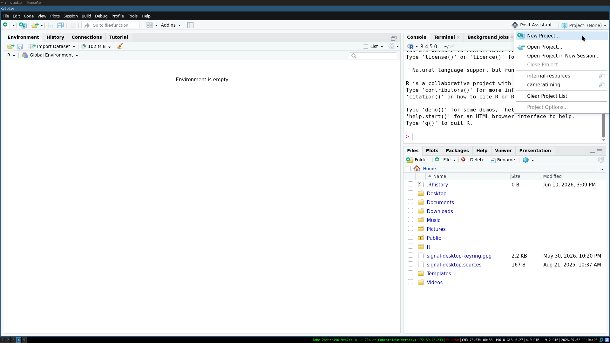
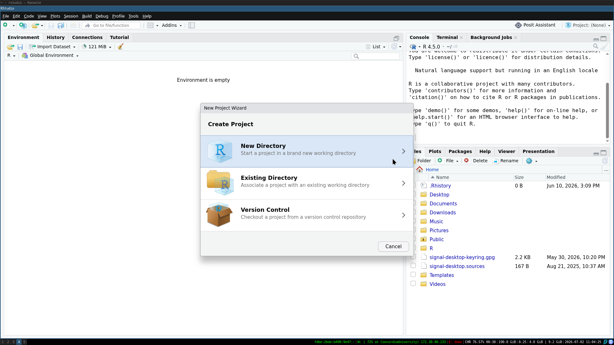

# Data Management & Archiving 

The WWALK lab highly values scientific rigour and reproducibility. One of the ways that we ensure our science is rigorous and reproducible is through the consistent application of a data management and archiving policy.

Data comes in all shapes and sizes in this lab. This policy applies to you no matter how you collected and used your data (e.g., fieldwork, open data, camera traps, etc.). Data management should start *before* you start collecting your data, to ensure that it is done in a transparent and reproducible way and to facilitate data archiving.

## Before you collect data

### 1. Data sheets

Regardless of whether you are using a tablet or paper, thinking about how you set up your data sheets so that data is clear and easy to input is important.

If using a tablet, make sure that there is a plan to back up the data to the cloud during data input in case the tablet is damaged or runs out of battery. Always bring a few paper datasheets in case of technological issues.

If putting out passive sensors and don't need datasheets, make sure that there is a recording of the sensor IDs and locations. 

### 2. Project repository

The set up of the project is critical to the future interpretability of the project. There should be one folder (repository) dedicated to each "project" on your computer. Often this looks like one repository per manuscript or chapter of your thesis. In the context of R + RStudio, the easiest way to create an easily shareable project repository is to use a RStudio Project.





Within the repository, good file structure allows you to manage all the components of your (often large) projects, while facilitating easy sharing and reducing the risk of accidentally deleting/altering important files.

Our lab generally sets up the file structure in a similar fashion (though it does not have to be exactly the same):

```         
project
└───data/
    └───derived/
    └───raw-data/
└───R/
└───script/
└───graphics/
└───README.md
```

Where the `input/` folder includes all raw data (and associated metadata - LINK). This folder should be backed up in multiple places. The `raw-data/` folder should be treated as read-only (do not edit these files directly). The `derived/` folder includes the edited versions of raw data files used for subsequent analysis.

`output/` folder includes all the outputs generated through your analysis. That could include spatial data, model outputs, summary tables, and more.

`R/` includes the scripts you use in your analysis. Obviously this example is specific to R but if you use a different coding language/multiple coding languages, you can adjust the name of the folder as is appropriate.

Within this folder, it should be easily identifiable which order scripts are used. The simplest way to do this is to name them sequentially. For example:

1-DataCleaning.R

2-DataPrep.R

3-Model.R

4-ModelFigure.R

`graphics/` holds all the figures and graphics that you produce through your analysis.

Finally, the README.md file can act as a type of metadata or project overview : it facilitates people using your data, script, etc. There are some basic requirements from a README in order to make your work usable. We need to know:

- how the data is structured what it describes

- how to read it (e.g. column headings and units)

- methodological information such as instrument settings and calibrations, reagents used, or survey questions

- exactly what they are allowed to do with the data through rights metadata such as licensing

- how to acknowledge the original creators by citing the data

**NOTE:** there is a second way that some people in the lab set up their repositories - the [{targets}](https://books.ropensci.org/targets/) package for setting up analysis as a pipeline. This approach will change the setup and how you interact with the code slightly. For more details, see [this workshop](https://robitalec.github.io/reproducible-workflows-workshop/) developed by lab member Bella and their colleague, [Alec Robitaille](https://robitalec.ca/).

### 3. GitHub

GitHub is a version control software, that allows you to track changes you make to your project while also facilitating collaboration, easy sharing, and backups.

From [missing semester](https://missing.csail.mit.edu/2020/version-control/):

> Version control systems (VCSs) are tools used to track changes to source code (or other collections of files and folders). As the name implies, these tools help maintain a history of changes; furthermore, they facilitate collaboration. VCSs track changes to a folder and its contents in a series of snapshots, where each snapshot encapsulates the entire state of files/folders within a top-level directory. VCSs also maintain metadata like who created each snapshot, messages associated with each snapshot, and so on.

> Why is version control useful? Even when you’re working by yourself, it can let you look at old snapshots of a project, keep a log of why certain changes were made, work on parallel branches of development, and much more. When working with others, it’s an invaluable tool for seeing what other people have changed, as well as resolving conflicts in concurrent development.

Each student project in the WWALK lab can go on your personal GitHub or on the [lab GitHub](https://github.com/zule-lab/). Setting your repository(ies) up before you are done data collection/have started coding, allows for a smooth transition. Many people in the lab have experience setting up GitHub repositories and using git, so if you are wondering how to do this, reach out to your labmates. There are also many online resources, some of which are linked in [References].

Some things to consider when using git:

- large files: GitHub repositories cannot store individual files \> 100 MB or repositories \> 10 GB. If you have large file(s), add them to your .gitignore document (see more [here](https://git-scm.com/docs/gitignore))

- private vs public: scientists generally publish our repositories as public as part of our commitment to open science. However, some data (and associated code) should NOT be publicly visible (e.g., interview data). Make sure to take all appropriate privacy precautions when working with git and when publicly archiving data.

## Post-data collection

### 1. Data back ups

Immediately upon data collection, you should be backing up your raw data files. Your raw data should be stored on your computer, the lab computer, and a cloud system. If you are collecting your data over months or years, your back up system should be established as soon as you have collected any raw data and added to as data collection continues.

**Personal Computers** Have your raw-data clearly labelled and in an easily-identifiable folder (see Project Repository section above). Treat the raw-data files as *read-only* and make copies of them before ever editing.

**Lab Computers** The lab computer in the WWALK lab can be accessed in person and remotely. Check details [here](/policies/04-lab-computer.qmd) on how to connect, so that you can back up your computer.

**Cloud Storage** As UCal students, you are given 100GB of OneDrive storage associated with your student email. This is a convenient cloud storage solution for most people in the lab. If this is not enough storage, contact the IT department for more storage solutions and/or discuss with Ally.


### 2. Metadata

All raw data files associated with your project should have accompanying metadata. There are many approaches to how to format and prepare metadata. If you are interested in learning more, you can check out these resources:

RESOURCES

For this lab, the minimum level of metadata that should be included is a text file found with your raw data that specifies the file name, general description of file, and a description of every column (with units).

For example, if your `raw-data/` folder looked something like:

```         
raw-data/
└───dataset1.csv
└───dataset2.csv
└───metadata.txt
```


The metadata.txt file could look something like:

```         
Project: Example Project
Author: Isabella Richmond 
Date: 21-05-2026

This project is a collaboration between X and Y to determmine the effect of A on B. Data collection occured HERE, at this TIME.

This metadata file describes the variables in each of the datasets that accompany: THESIS OR PAPER TITLE (link if published + pdf in folder)

Code can be found: (in folder or on GitHub)

DATASETS (go through each csv in the folder and describe each column)

dataset: dataset1.csv
overall description: 
column_1: description of column 1 (units)
column_2: description of column 2 (units)


dataset: dataset2.csv
overall description: 
column_1: description of column 1 (units)
column_2: description of column 2 (units)
```

Note: before archiving your data, make sure that **all** data files are accompanied by metadata. For many of us, clear and comprehensive metadata is a condition of our data sharing agreements. This is a critical output, that should never be skipped.

Tip: writing your metadata as you are inputting your raw data can be very helpful when writing your methods section, so you don't forget any details or units for measurements.

## When the project ends

After finishing your project(s) in the lab, you are expected to archive all data, metadata, and code that was used for your project.

All data should always be accompanied with metadata.


1.  Archiving publicly

Many of you will already have some version of your code/data published and archived in public spaces (e.g., GitHub, Zenodo, figshare). This is great! Make sure it is clear in your paper or thesis where to find these resources, so that future students/collaborators/Ally can find them in the future.

If you are using GitHub, you are welcome to have your code repository hosted on your personal GitHub account. You are also welcome to host it on the WWALK GitHub account, so that it is more easily found by WWALKers. Even if on the WWALK GitHub, all the commits will be associated to your account and it will be clear that you are the one who did the work. You can also [pin](https://docs.github.com/en/account-and-profile/how-tos/profile-customization/pinning-items-to-your-profile) the repository to your user profile, so that people visiting your account can see it.

If you want to change the ownership of a repository (transfer it to your account from the WWALK account or vice versa), see [this page](https://docs.github.com/en/repositories/creating-and-managing-repositories/transferring-a-repository#transferring-a-repository-owned-by-your-personal-account)


2.  Archiving on lab computer

In addition to public archiving, you are expected to archive your project physically in the lab.

If all of your code, data, and metadata is already archived publicly, this can be as easy as downloading a zip file and putting it WHERE.

If some of your data is not suitable to be publicly available, you may need to add it to your publicly archived version and set permission restrictions on the folder on WHERE so that only yourself and Ally can access the folder.

To archive your project on WHERE, remotely (or locally) connect to the [lab computer](/policies/04-lab-computer.qmd) and add data, metadata, code, thesis/paper(s), and any presentations to WHERE in a folder that is titled YOUR_NAME_YEAR.


## References

[R for Reproducible Scientific Analysis](https://swcarpentry.github.io/r-novice-gapminder/index.html):

[Efficient R Programming](https://csgillespie.github.io/efficientR/set-up.html#project-management)

[ARDC Metadata Guide](https://zenodo.org/record/6459832)

[ZULE's Data and GitHub Crash Course](https://zule-lab.github.io/data-github-workshop/)

[Data Analysis & Visualization in R for Ecologists](https://datacarpentry.org/R-ecology-lesson/index.html)

[Data Organization in Spreadsheets for Ecologists](https://datacarpentry.org/R-ecology-lesson/index.html)

[Version Control with Git and GitHub](https://biostats-r.github.io/biostats/github/)

[happygitwithr](https://happygitwithr.com/)

[Open Access to Research Data](https://www.uib.no/en/ub/111372/open-access-research-data#metadata-describe-your-data)

[Val Lucet's Git Workshop](https://vlucet.github.io/git-and-github-with-r-workshop/)

